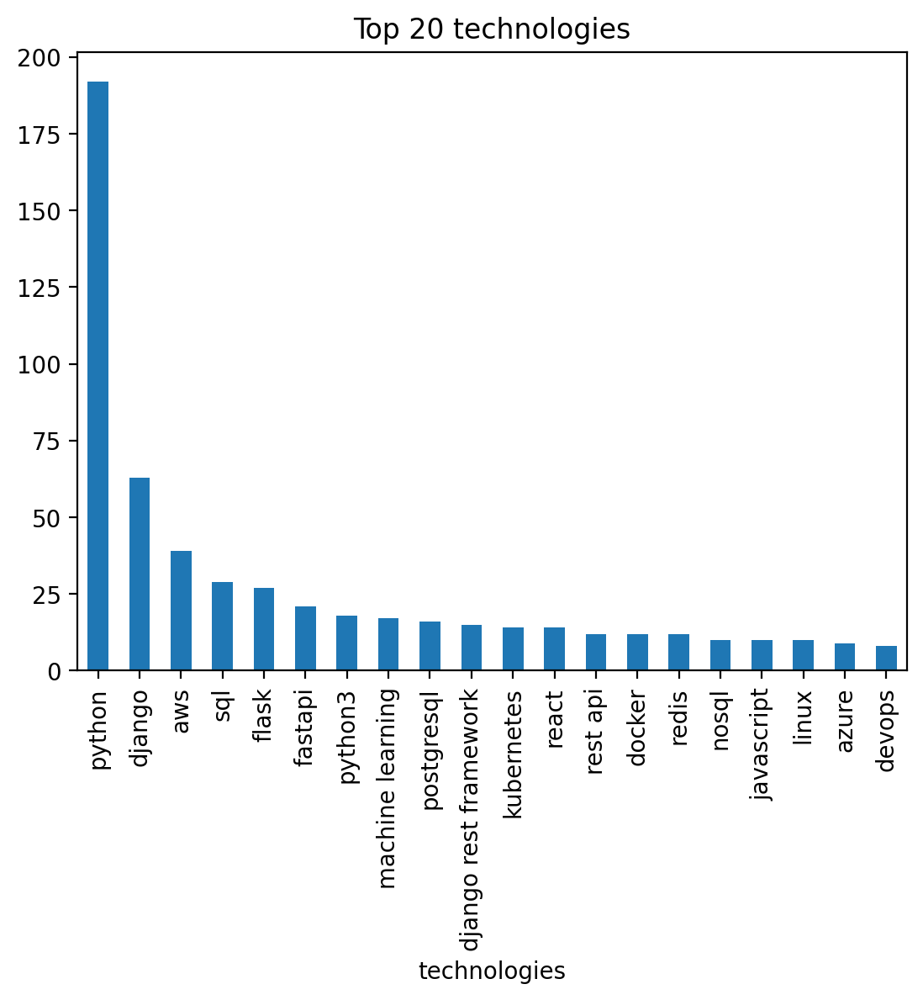

# Djinni Python Technologies Statistics Project
Small app that serves for analysis and visualization or most-demanded technologies for python developers right now


## The App has the following features:
1. Scraping information from djinni website using parse.py module
2. Data clearing and analyzing using analysis.ipynb
3. History stored in "history" folder

## Getting Started
1. Clone this repository to your local machine ```git clone the-link-from-your-forked-repo```.
2. Create a virtual environment using ```python -m venv env```.
3. Activate the virtual environment using ```source env/bin/activate(on macOS)``` Or ```env\Scripts\activate (on Windows)```.
4. Install the required dependencies using ```pip install -r requirements.txt```.
5. Run ```python parse.py```.
6. After completion, run all cells in analysis.ipynb

## DEMO

